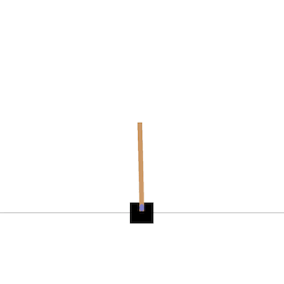

# Cartpole-V0

 We took up the Cartpole-v0 problem in the [OpenAI gym toolkit](www.google.com) in order to carry out this project. This problem is said to be solved when the average reward over 100 consecutive episodes is equal to or greater than 195. 
• Through the use of reinforcement learning techniques, we successfully constructed a Q-learning agent and a Deep Q-learning Network agent which successfully solved the problem.
• Additionally, the DQN agent arrived at an optimal policy which successfully attained an average reward of a perfect 200 after completion of neural network training.
